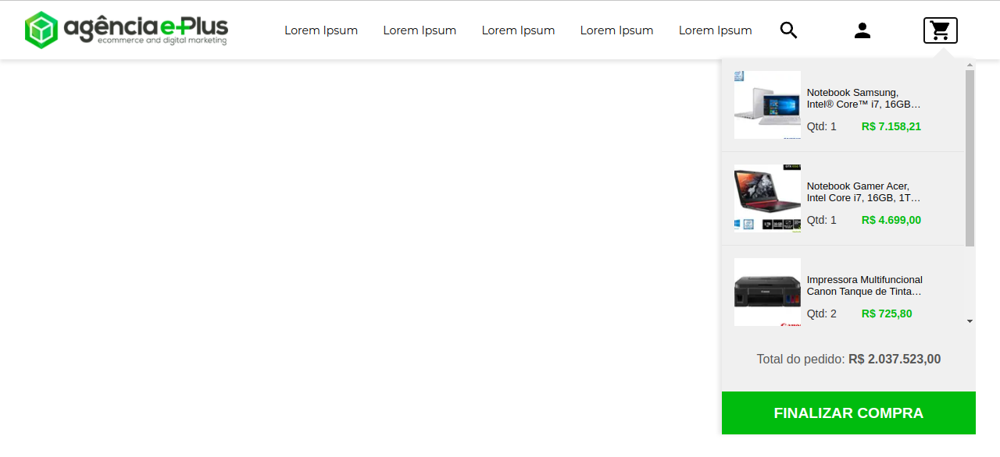

<div align="center" id="top"> 
  

&#xa0;

</div>

<h1 align="center">Challenge Front</h1>

<p align="center">
  

  

  
</p>

<p align="center">
  <a href="#dart-Sobre">Sobre</a> &#xa0; | &#xa0; 
  <a href="#sparkles-features">Funcionalidades</a> &#xa0; | &#xa0;
  <a href="#rocket-technologies">Tecnologias</a> &#xa0; | &#xa0;
  <a href="#white_check_mark-requirements">Requerimentos</a> &#xa0; | &#xa0;
  <a href="#checkered_flag-starting">Iniciando</a> &#xa0; | &#xa0;
  <a href="https://github.com/tarcisiodelmondes" target="_blank">Author</a>
</p>

<br>

## :dart: Sobre

Desafio E-Plus Front-end

## :sparkles: Features

- Responsividade
- Navegação pelo teclado
- Utilizei o sass para estilizar a página
- Componetizei a aplicação
- Criei um contexto usando a Context API do React para
  controlar o estado do carrinho de compras
- Utilizei o component Image do Next.JS para otimizar as imagens
- Utilizei o json-server para criar um servidor fake
- Utilizei o axios para consumir o servidor fake e montar o layout
  do carrinho de compras
- Utilizei a fonte Montserrat e os ícones do Materia Design

## :rocket: Tecnologias

As seguintes ferramentas foram utilizadas neste projeto:

- [Sass](https://sass-lang.com/)
- [Node.js](https://nodejs.org/en/)
- [React](https://pt-br.reactjs.org/)
- [TypeScript](https://www.typescriptlang.org/)
- Axios
- Json-server

## :white_check_mark: Requisitos

Antes de iniciar :checkered_flag:, você precisa ter [Git](https://git-scm.com) e [Node](https://nodejs.org/en/) instalados.

## :checkered_flag: Iniciando

```bash
# Clone este projeto
$ git clone https://github.com/tarcisiodelmondes/challenge-front

# Acesse
$ cd challenge-front

# Instale as dependências
$ yarn
# Ou
$ npm install

# Inicie o json-server, ele vai servir os produtos
# veja os produtos no <http://localhost:3333/cart>
$ yarn server
# Ou
$ npm run server

# Entre na pasta do projeto web
$ cd web

# Instale as dependências
$ yarn
# Ou
$ npm install

# Rode o projeto web e acesse <http://localhost:3000>
# para ver o projeto web
$ yarn dev
# Ou
$ npm run dev
```

Feito com :heart: by Tarcísio Delmondes

&#xa0;

<a href="#top">Voltar pro topo</a>
